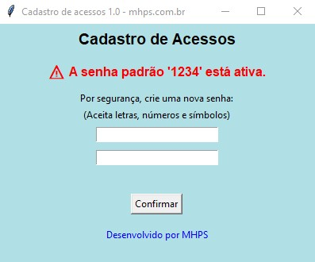
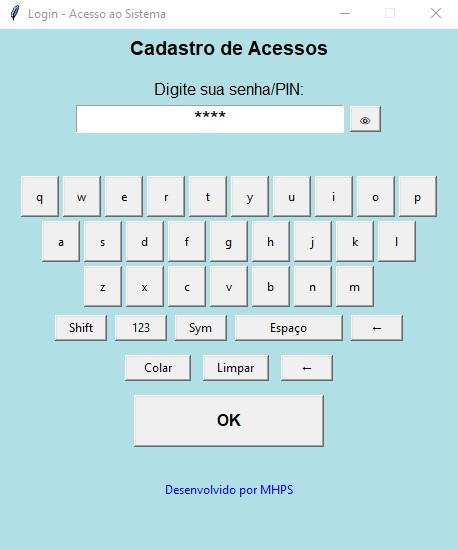
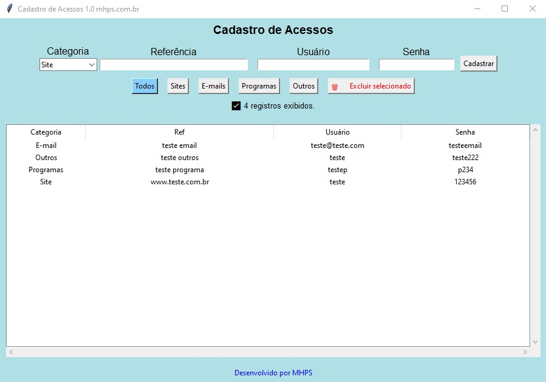

# 🔑 pyPass - Gerenciador de Acessos

Aplicativo desktop em **Python + Tkinter** com banco de dados criptografado em **SQLCipher** para gerenciamento seguro de senhas e acessos.  
Permite cadastrar, editar, excluir e consultar logins de sites, e-mails, programas e outros.

## 📸 Capturas de Tela
### Tela de Login


### Tela de Alteração de Senha Padrão


### Tela Principal


---

## 🚀 Funcionalidades
- ✅ Banco de dados criptografado com **SQLCipher**
- ✅ Tela de login com teclado virtual (letras, números e símbolos)
- ✅ Alerta e obrigatoriedade de alterar a senha padrão `1234`
- ✅ Cadastro de novos acessos com categoria, referência, usuário e senha
- ✅ Edição e exclusão de registros existentes
- ✅ Filtro por categoria
- ✅ Cópia rápida de usuário, senha ou referência
- ✅ Interface organizada e intuitiva em **Tkinter**
- ✅ Exportação para `.exe` (rodar em qualquer Windows sem precisar de Python)

---

## 🛠️ Estrutura do Projeto
```
pyPass/
│-- main.py          # Arquivo inicial do programa
│-- db_utils.py      # Funções utilitárias para acesso ao banco SQLCipher
│-- tela_login.py    # Tela de login + teclado virtual
│-- tela_alterar.py  # Tela para forçar alteração da senha padrão
│-- tela_main.py     # Tela principal com CRUD dos registros
│-- src/
│   └── site.py      # Rodapé com créditos/links
│-- geral.db         # Banco de dados criptografado (SQLCipher)
│-- tela1.jpg        # Screenshot: Tela de Login
│-- tela2.jpg        # Screenshot: Tela Alterar Senha
│-- tela3.jpg        # Screenshot: Tela Principal
```

---

## 📦 Instalação

### 1. Clonar o repositório
```bash
git clone https://github.com/seu-usuario/pyPass.git
cd pyPass
```

### 2. Criar e ativar ambiente virtual (opcional, mas recomendado)
```bash
python -m venv .venv
source .venv/bin/activate   # Linux/Mac
.venv\Scripts\activate      # Windows
```

### 3. Instalar dependências
```bash
pip install -r requirements.txt
```

📌 **requirements.txt sugerido**:
```
sqlcipher3-binary
tk
```

---

## ▶️ Executar o Projeto
```bash
python main.py
```

---

## 🖥️ Gerar Executável (.exe)

O projeto já foi testado com **PyInstaller**.  
Para criar um `.exe` que roda em qualquer Windows:

```bash
pyinstaller --onefile --noconsole main.py
```

O arquivo final estará em `dist/main.exe`.

---

## 🔒 Segurança
- O banco de dados `geral.db` é protegido por **criptografia SQLCipher**.
- Senha padrão inicial é `1234` → obrigatória a alteração no primeiro uso.
- Recomenda-se escolher uma senha forte.

---

## 👨‍💻 Autor
Projeto desenvolvido por **Aleca (mhps.com.br)**  
📧 Contato: [seu-email-aqui]

---

## 📜 Licença
Distribuído sob a licença MIT. Veja `LICENSE` para mais detalhes.
